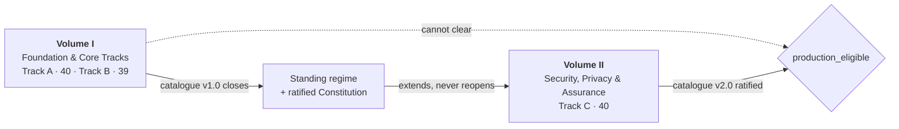

<!-- markdownlint-disable MD033 -->
<h1 align="center">AI Audit Mandate</h1>
<p align="center">
  <strong>A due-diligence and remediation mandate for software that no human reviews.</strong>
</p>
<p align="center">
  <a href="https://github.com/mglaeser/ai-audit-mandate/actions/workflows/ci.yml"></a>
  <a href="docs/check-index.md"></a>
  <a href="mandate/"></a>
  <a href="LICENSE"></a>
</p>
<!-- markdownlint-enable MD033 -->

Your codebase was written, configured, tested and documented by AI agents. Nobody
read the diff. Nobody is going to. **This is the audit for that situation** — 119
checks in two volumes that find out what is actually true about such a system,
repair it in a defensible order, and leave behind machinery that keeps it true
after the audit ends.

It is not a checklist you tick. Every finding closes with a control you have
*watched* block something, or it does not close.

## Start in one paste

The mandate runs at three depths. Find your row, paste that line into your coding
agent, and it reads the full instructions from here and starts working.

| If this is true of your repository | Start at |
| --- | --- |
| It cannot reach production — no live credentials, no real user data | [**Level 1**](#level-1--baseline) |
| It serves real users, and nobody reads the diffs | [**Level 2**](#level-2--governed) |
| It must outlive you, and you can field a second-vendor verifier | [**Level 3**](#level-3--standing-regime) |

What separates them is not how many checks you run. Every serious engagement runs
all 119. It is whether a control **executes**: described, then running, then
proven to still be running.

### Level 1 · Baseline

**Finds out what is true.** Every check gets a verdict backed by an artifact
someone else can re-examine, and every claim your repository makes about itself
is reconciled against the code. Nothing changes.

```text
Read https://github.com/mglaeser/ai-audit-mandate/blob/main/docs/prompts/level-1-baseline.md and execute it against this repository.
```

Leaves an `audit/` folder behind. No new code, no new tests. An afternoon,
usually 1–3 pull requests.

### Level 2 · Governed

**Makes the findings block.** The audit's conclusions become gates: CI starts
refusing the mistakes it found, and deploy admission fails closed. Each described
control becomes a running one.

```text
Read https://github.com/mglaeser/ai-audit-mandate/blob/main/docs/prompts/level-2-governed.md and execute it against this repository.
```

Leaves 10–25 control scripts and 15–200 tests behind, one per fix. A few days,
usually 10–25 pull requests.

> [!TIP]
> Level 2 is the honest ceiling for a single-operator project, and a respectable
> place to stop — provided you write down *why* you stopped.

### Level 3 · Standing regime

**Proves the controls still block.** Seeded defects are re-injected on a
schedule, the gate carries a self-test that fails when it stops catching, and
baselines may only improve. A running control becomes a calibrated one.

```text
Read https://github.com/mglaeser/ai-audit-mandate/blob/main/docs/prompts/level-3-standing-regime.md and execute it against this repository.
```

Leaves 25–30 control scripts and 200–2,000 tests behind, because the controls get
tested too. Weeks, usually 30–60 pull requests. It needs an independent verifier
from a second vendor and a scheduled runner — if you cannot field both, Level 2
with the gap recorded is the stronger and more truthful outcome.

Levels are cumulative and resumable: Level 2 starts from Level 1's findings
rather than re-deriving them. [Compare the three side by side](docs/adoption-levels.md).

> [!IMPORTANT]
> Whichever you start, do not fix anything before Phase 3 completes. A fix
> applied during discovery destroys the evidence that justified it.

<details>
<summary><b>Prefer to drive it yourself, without an agent?</b></summary>

Scaffold the workspace directly and work the phases by hand:

```bash
git clone https://github.com/mglaeser/ai-audit-mandate.git
cd ai-audit-mandate
npm ci
node scripts/new-engagement.mjs --target ../your-repository
```

```text
new-engagement: scaffolded ../your-repository/audit
  119 checks seeded at NO-EVIDENCE (79 active, 40 registered for Volume II)
  mandate pinned at sha256:60ad9a3f…
```

Your repository now has an `audit/` workspace where every check starts at
`NO-EVIDENCE` and `production_eligible` reads `false`. Both are correct. Unknown
is not neutral — it fails closed, and keeps failing closed until evidence says
otherwise.

Then read [Volume I](mandate/01-foundation-and-core-tracks.md) before you touch
anything, and work the phases in order.

</details>

*Effort figures are what four real implementations of this mandate actually
added, counting individual test cases rather than lines of test code. The spread
is real: a project that builds its own verification infrastructure wrote 2,023
tests; one that configured existing tools wrote 15.*

## The problem this solves

In a conventional audit, a great many controls are ultimately discharged by a
person: an engineer reads a diff and says *wait*. That person is the residual
safety net beneath every other control, and most audit frameworks quietly assume
they exist.

Here they do not. So every function that net performed has to be replaced by
something deterministic, machine-executed, adversarially tested, and fail-closed.
That substitution is what this mandate is actually about.

> **Humans set the specification and hold the halt authority. They do not review changes.**
> The human is **in command**, never **in the loop**.

## What makes this different

- **Unknown blocks.** `NO-EVIDENCE` is the starting verdict and it is a blocking
  state. A check nobody ran is not a check that passed.
- **A fix is not a closure.** Findings close on a fix *plus* permanent machinery
  with a cadence, a ratchet, its own calibration, and an owning role.
- **Controls must be witnessed.** Re-introduce the defect, record the refusal. A
  control you have not seen fire is a control you are hoping about.
- **Clones, not instances.** One generator wrote everything, so a missing
  ownership check is never one bug — it is a template applied fifteen times. A
  finding stays open while a clone survives.
- **Structure beats policing.** 44 checks carry a *structural fix*: make the
  defect unrepresentable rather than detectable. You stop finding the bug because
  you can no longer write it.
- **The verifier is not the author.** The model family that wrote the bug cannot
  be the one that certifies the fix. Different vendor, falsifying objective,
  deterministic arbiter.
- **"A human reviews it" is an automatic FAIL.** That answer is not available
  here, and writing it down leaves the gap open while making it look closed.

## The two volumes



| | [Volume I](mandate/01-foundation-and-core-tracks.md) | [Volume II](mandate/02-security-privacy-assurance.md) |
| --- | --- | --- |
| **Scope** | What was built, and how it ships | What an attacker or regulator will ask |
| **Tracks** | A — Product, Design, Code Integrity<br>B — Platform, Delivery, Runtime | C — Security, Privacy, Assurance |
| **Checks** | 79 | 40 |
| **Also delivers** | Execution protocol, finding schema, standing regime, the Constitution | Catalogue v2.0, re-ratification, closing definition of done |
| **Clears production?** | **Never** | Only this volume can |

Volume I is standalone-complete but is not the whole mandate. It builds the
apparatus; Volume II extends it and cannot substitute for it. Two of the three
unconditional `STOP-SHIP` checks live in Track C, and no volume that has not
audited them may clear traffic past them.

That constraint is not a sentence a reader can skim. It is a computed field in
`audit/engagement-status.json` that a deploy gate reads and fails closed on.

## Severity, and what blocks

| Band | Priority | Count | Effect |
| --- | --- | --- | --- |
| `STOP-SHIP` | 10, or escalated | 3 direct, 6 conditional | No production traffic |
| `BLOCKER-1` | 9 | 16 | Blocks release |
| `BLOCKER-2` | 8 | 23 | Blocks release |
| `MUST-FIX` | 7 | 35 | Fix, or a dated residual record with a tripwire |
| `SHOULD-FIX` | 6 | 28 | Fix, or schedule with a date and a tripwire |
| `PLAN` | 5 | 9 | Backlog with written rationale |
| `ASSESS` | ≤4 | 5 | Assess, document materiality |

Browse everything in the [check index](docs/check-index.md), or query the
generated [catalogue](catalogue/checks.json):

```bash
jq -r '.checks[] | select(.has_structural_fix) | "\(.id)  \(.title)"' catalogue/checks.json
```

## How deep to go

All three levels run all 119 checks — a check you skip is a denominator you
quietly shrank. What separates them is whether a control **executes**.

| | Level 1 | Level 2 | Level 3 |
| --- | --- | --- | --- |
| Controls | described | run and block | calibrated against their own decay |
| Constitution | none | in force | ratified |
| Clears production | no | no | when computed |

A described control is a claim. A running control is a fact. A calibrated control
is a fact that stays true after you stop paying attention.

## Repository layout

| Path | What lives there |
| --- | --- |
| [`mandate/`](mandate) | The two volumes and their integrity manifest. **The source of truth.** |
| [`catalogue/`](catalogue) | `checks.json`, generated from the prose. Never edited by hand. |
| [`docs/`](docs) | Adoption levels, the three prompts, concepts, the browsable check index. |
| [`templates/`](templates) | The workspace and record formats an engagement fills in. |
| [`scripts/`](scripts) | Catalogue extraction, manifest generation, engagement scaffolding. |

The prose is authoritative and the JSON is derived — never the reverse. `npm run
verify` regenerates both and fails if either drifted. Byte comparison alone would
only prove the catalogue matches today's extractor, so the build additionally
asserts the extracted bands and escalations against the mandate's own §3 and §7
tables, and refuses to write a catalogue that disagrees with them.

## Integrity

An engagement pins the exact text it ran under. [`mandate/manifest.json`](mandate/manifest.json)
records a SHA-256 per volume plus a combined hash over their deterministic
concatenation:

```bash
npm run verify
```

```text
build-catalogue: catalogue is current (119 checks).
build-manifest: manifest is current (combined sha256:60ad9a3f…).
```

A mandate that shifts mid-engagement is an engagement with no fixed denominator.
Wire this into CI.

## Documentation

- **[Adoption levels](docs/adoption-levels.md)** — how deep to go, and how to choose honestly.
- **[Prompts](docs/prompts/README.md)** — three copy-paste starting points, one per level.
- **[Getting started](docs/getting-started.md)** — clone to running engagement, phase by phase.
- **[Concepts](docs/concepts.md)** — the operating model, the five hazards, substitution, ratchets and decay.
- **[Check index](docs/check-index.md)** — all 119 checks, browsable, with bands and structural-fix markers.
- **[Templates](templates/README.md)** — the artifacts an engagement produces.

## Who this is for

Written for a web application implemented end-to-end by AI, maintained without
human code review, and required to stay correct. If that is not quite your
situation, some checks will be over-engineered for you — read them anyway, since
the substitution behind each usually still applies, then mark what genuinely does
not apply as `NOT-APPLICABLE` **with a reason**. Quietly dropping a check is how
a catalogue becomes decoration.

## Contributing

Issues and pull requests are welcome — see [CONTRIBUTING.md](CONTRIBUTING.md).
The one rule specific to this repository: a change to a check must strengthen it
or make it more precisely falsifiable. Softening a check to make an engagement
easier to pass is the failure mode this whole document exists to prevent.

## License

[CC BY 4.0](LICENSE). Use it, adapt it to your own systems, keep the attribution.
