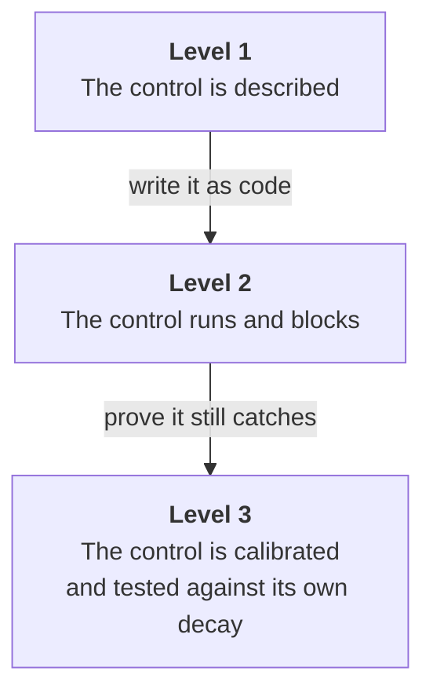

# Adoption levels

The mandate is written for the hardest case: a production system nobody reviews.
Most repositories are not that, yet, and running the full apparatus on a prototype
is how the apparatus gets resented into irrelevance.

So there are three levels. They are not three different mandates — they are three
**depths of the same one**, and they line up with the repository classes the
Constitution already defines in Article XV.

| | Level 1 — Baseline | Level 2 — Governed | Level 3 — Standing regime |
| --- | --- | --- | --- |
| **Repository class** | Experimental | Incubating | Production |
| **Question it answers** | What is actually true here? | What is true, and what keeps it true? | What survives everyone leaving? |
| **Checks run** | 119, triaged | 119, evidenced | 119, evidenced and re-verified |
| **Volumes** | I | I, then II | I, then II, then ratification |
| **Controls** | recommended, not built | executable, blocking merges | blocking, self-testing, calibrated |
| **Constitution** | none | `IN_FORCE_PROVISIONAL` | `RATIFIED` |
| **Clears production** | no | no | yes, when computed |
| **Effort** | hours | days | weeks, then permanent |

## What it costs

Measured across four real implementations of this mandate. The mandate's own text
is excluded — you copy that rather than write it — so these are lines an
engagement actually authors.

| | Level 1 | Level 2 | Level 3 |
| --- | --- | --- | --- |
| Audit and governance docs | 2,500–6,000 | 4,000–8,000 | 5,000–10,000 |
| Control and CI code | — | 1,500–4,000 | 5,000–15,000 |
| Tests | — | 500–3,000 | 3,000–10,000 |
| Pull requests | 1–3 | 10–25 | 30–60 |
| Calendar time | hours | days | weeks, then permanent |

Two cautions about these numbers.

**Documentation is the stable part.** Across every engagement observed, the
`audit/` artifact set landed between three and seven thousand lines regardless of
depth. The catalogue is fixed at 119 checks, so the writing is roughly fixed too.

**Control code is the volatile part**, and the range understates the ceiling. One
engagement that built a fully write-separated verifier lane wrote about 36,000
lines of control code and 31,000 lines of tests — the verifier alone was 25,000.
If Level 3 means building that lane rather than configuring one, plan for
multiples of the figure above.

Pull-request counts track remediation waves rather than findings: controls land
one reviewed change at a time, which is the point. A three-PR engagement batched
its waves; a forty-PR engagement did not.

## What separates the levels

Not the number of checks. Every serious engagement runs all 119 — a check you
skip is a denominator you quietly shrank.

What separates them is **whether a control executes**.

A described control is a claim. A running control is a fact. A calibrated control
is a fact that stays true after you stop paying attention — and that last step is
the one that decides whether any of this survives the quarter.

### Breadth and depth are different axes

A repository can be broad — all 119 checks evidenced, constitution ratified — and
still shallow on the two hardest controls. Another can skip the constitution
entirely and go far deeper on exactly those.

The two that separate a serious regime from a thorough one:

- **Independent verification (`A-39`, Article IV).** A verifier from a different
  vendor that attacks the change, with the deterministic gate as sole merge
  authority. Hard, and usually the first thing dropped.
- **Separation of the gate from the gated (`B-35`, Article II).** The identity
  that writes code cannot modify the gate, and the reviewed artifact never holds
  the reviewer's credentials.

Level 3 requires both. If you have broad coverage but neither of these, you are
at Level 2 with good documentation — which is a fine place to be, provided the
residual register says so.

## Level 1 — Baseline

**You get:** an honest inventory. All 119 checks carry a verdict backed by
evidence, every claim the repository makes about itself is reconciled against
reality, and the findings are banded so you know what is actually dangerous.

**You do not get:** anything that prevents regression. Level 1 tells you where
you stand; it does not hold the ground.

**Stop here when** the repository is exploratory and structurally cannot reach
production — no production credentials, no personal data, sandboxed egress. That
exemption is safe because it is structural, not because anyone promised to be
careful.

## Level 2 — Governed

**You get:** the findings from Level 1, plus a deterministic gate that blocks
merges, the top structural fixes actually taken, a provisional constitution, and
a deploy-admission check that fails closed. Track C runs, so the security scope
is evidenced rather than assumed.

**You do not get:** proof that the gate still works next month. The controls run,
but nothing yet tests them for decay.

**Stop here when** the system is real but single-operator, or when a genuine
second verifier and a scheduled runner are out of reach. This is the honest
ceiling for most small projects, and it is a respectable place to stop — provided
you write down *why* you stopped, which is what the exceptions ledger is for.

## Level 3 — Standing regime

**You get:** everything, plus the part that matters most — machinery that proves
itself. Seeded defects are re-injected on a schedule and the pipeline's catch rate
becomes a live signal that freezes releases when it falls. The gate carries a
self-test that fails when the gate stops catching. Baselines ratchet. The
constitution is ratified and hash-attested, and `production_eligible` becomes
computable.

**Stop here** because there is nowhere further to go. The engagement ends; the
regime does not.

## Choosing honestly

Two failure modes, both common:

**Overreaching.** Declaring Level 3 on a repository that cannot sustain it
produces documentation of controls nobody runs — the decorative gate the mandate
exists to catch. If you cannot field an independent verifier from a second
vendor, say so in the residual-risk register and stay at Level 2. A recorded
limitation is a finding; a hidden one is a lie.

**Underreaching.** Staying at Level 1 while serving real users means your audit
is a snapshot that started decaying the moment it was written. If the system
handles anyone's data, Level 1 is not enough, and `production_eligible: false` is
telling you exactly that.

## Moving up

Levels are cumulative and resumable. Level 2 starts from Level 1's findings
rather than re-deriving them; Level 3 extends Level 2's regime rather than
replacing it. Nothing is wasted by starting lower, which is the argument for
starting lower.

The one rule: **`production_eligible` may only ever be computed.** No level lets
you assert it, and reaching Level 3 does not mean the answer becomes `true` — it
means the answer becomes *knowable*.

---

**Ready to start?** Each level has a single prompt you can paste into your coding
agent: [prompts](prompts/README.md).
